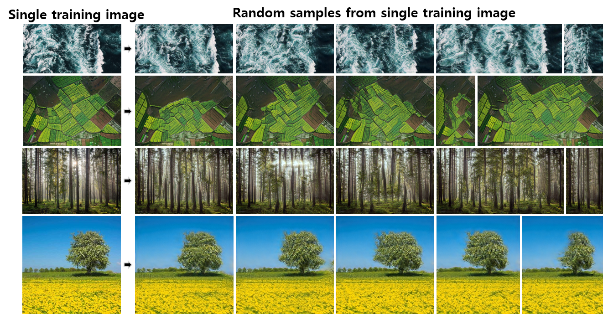
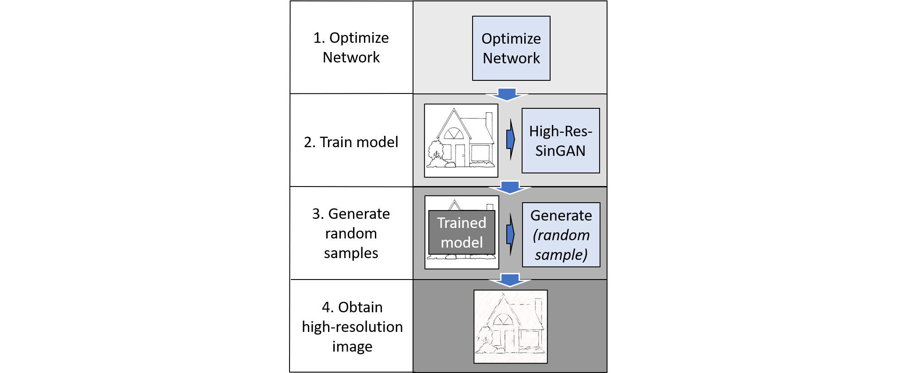
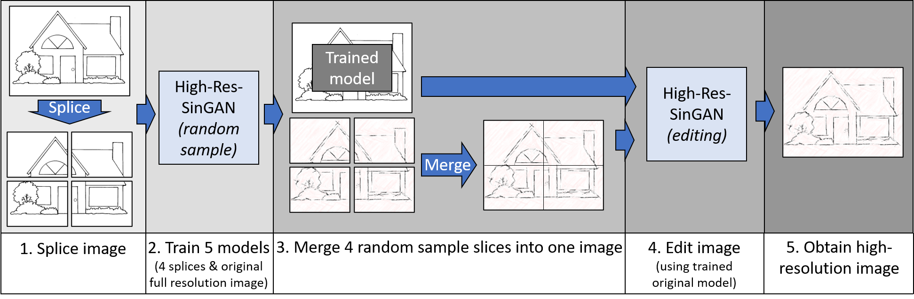

# High-Res-SinGAN

High-Res-SinGAN is an amplified version of [SinGAN](https://github.com/tamarott/SinGAN.git)
capable of producing images up to 500 x 500 pixels.

This repository is part of the *Neural Networks for Image Processing* course at DGIST.
For this course, several presentations were held. The presentation files can be found
in [supplementary_files/](supplementary_files/). The two-page paper concluding this
project can be found [here](supplementary_files/High-Res-SinGAN_paper.pdf).

### SinGAN

SinGAN produces random sample images from a single natural image using a generative adverserial network.




## Installation

- Python 3.6

```
python -m pip install -r requirements.txt
```

## Random Sample Generation

### Standard Resolution

To train a model with the default parameters of SinGAN run:
```
python main_train.py --input_name <training_image_file_name>
```
Training image files for the standard resolution model need to be placed in [Input/Images/](Input/Images/).
The training time should be about 40 minutes on an NVIDIA GeForce RTX 2070 SUPER.


### High Resolution

### Optimization (Method 1)

High resolution image generation can be achieved by modifying the structure of SinGAN. For this, we have 
introduced additional parameters that are adjusted automatically. The full structure is as follows:



All that is required is to specify the
desired output image size (up to 500px for the longest dimension). To train a high resolution model with 
this method run:
```
python HR.py --input_name <training_image_file_name> --size <desired output size>
```
Training image files for the high resolution model using method 1 need to be placed in [Input/Images/](Input/Images/).

### Image Splicing (Method 2)

Another method for generating high resolution images is divide the image into smaller sections that are each
trained individually and later spliced together to create a high resolution output.



Images may be any size up to 500px for the longest dimension. To use this method run:
```
python splicing.py --input_name <training_image_file_name>
```
Training image files for the high resolution model using method 2 need to be placed in [Input/Splicing/](Input/Splicing/).
